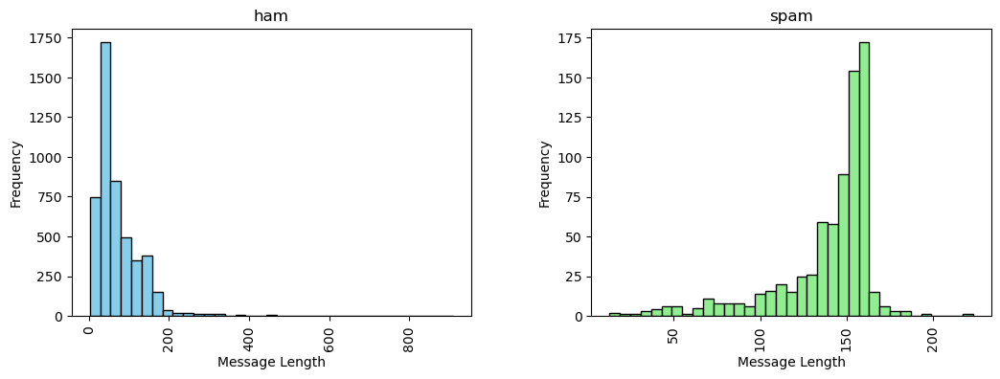

# Spam Classifier

Using NLP to create a spam filter

## Dataset 
[SMSSpamCollection](https://doi.org/10.24432/C5CC84.), Almeida,Tiago and Hidalgo,Jos. (2012). SMS Spam Collection. UCI Machine Learning Repository. 

### Dataset Attributes

- (.tsv) Tab Seperated Values
- 5572 Instances
- label column := ham or spam
- 4825 instances are ham
- 747 instances are spam

## Histogram

### Ham or Spam

Data above illustrates:
- Majority of the ham messages have a length between 50 to 100.
- Majority of the spam messages occur closer to the 150 message length.